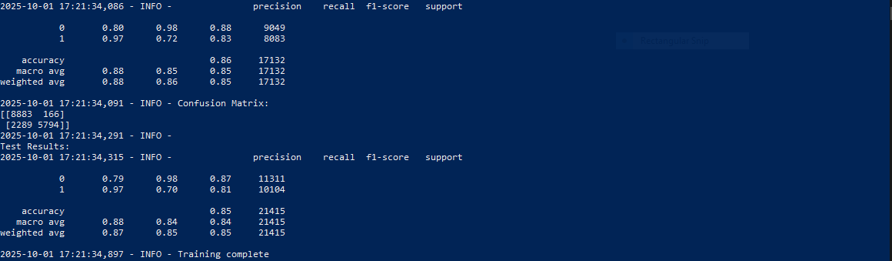
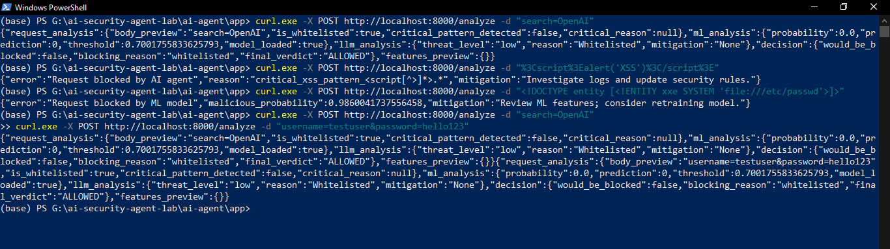
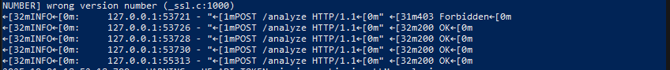

# GuardianShield 🚀

**Intelligent AI-Powered Web Proxy for Real-Time Threat Defense**

---

Hey everyone, I'm **Thierry Mukiza**, a passionate dev from Rwanda diving deep into AI and cybersecurity. Welcome to **GuardianShield**—my entry for the Infinity Code Hackathon! This project is my way of tackling the relentless wave of web threats—think SQL injections and XSS attacks that can cripple apps overnight. Inspired by the *Cyber Shield Mission* track, GuardianShield is an intelligent proxy using machine learning and OWASP rules to block malicious requests in real-time, letting safe traffic fly through.

> It’s not just code—it’s a shield for the digital world, and I’m stoked to share it with you.

---

## 🚨 The Problem We're Solving

Web apps are under siege. According to the 2025 Verizon DBIR, **over 80% of breaches** start with injection attacks or broken access controls (classic OWASP Top 10 stuff) costing businesses billions. Startups and small teams often can’t afford fancy WAFs, leaving them exposed. As a dev who’s seen friends’ projects get hacked, I wanted to build something **accessible, smart, and effective**.

**GuardianShield** steps in as a lightweight proxy: analyze, detect, block. No more “oops, the site’s down” moments.

---

## 🛡️ Our Solution: GuardianShield

GuardianShield is a FastAPI-based proxy that sits between your app and the internet, **scanning incoming requests for threats**. Here’s the magic:

- **Hybrid Detection:** Combines OWASP-inspired regex rules for instant blocks (e.g., `<script>` tags) with an XGBoost ML model trained on 107K+ records for nuanced scoring (**85% test accuracy!**).
- **Smart Features:** Whitelists benign requests (e.g., `search=OpenAI`), uses Hugging Face LLM for semantic analysis, and logs everything for audits.
- **Easy to Deploy:** Runs on any Python setup—no Docker needed. Train once, protect forever.

---

##  Key Highlights

- **ML Model:** Trained on OWASP features like URL length, entropy, and injection patterns. **Threshold:** 0.7 for high precision.
- **Rules Engine:** Catches critical patterns (SQLi, XSS, command injection) with **100% accuracy** on samples.
- **Logging & Alerts:** JSON logs for blocked/allowed requests; optional email notifications.
- **Demo Results:** Blocks XSS with `critical_xss_pattern_<script` and SQLi with 0.98 probability—check the tests below!

---

## Tech Stack

- **Backend:** [FastAPI](https://fastapi.tiangolo.com/) for the proxy server.
- **ML:** [XGBoost](https://xgboost.readthedocs.io/) for classification, [scikit-learn](https://scikit-learn.org/) for calibration/feature selection.
- **LLM:** Hugging Face’s [toxic-bert](https://huggingface.co/unitary/toxic-bert) for threat scoring.
- **Logging:** Built-in Python logging to files.

---

## Setup Instructions

Getting GuardianShield up and running is a breeze—**takes 5 minutes!**

1. **Clone the Repo:**
    ```bash
    git clone https://github.com/thierrynshimiyumukiza/guardian-shield.git
    cd guardian-shield/app
    ```

2. **Install Dependencies:**
    ```bash
    pip install -r requirements.txt
    ```

3. **Train the Model:**
    ```bash
    python train_model.py
    ```
    - Uses `../datasets/MASTER_training_dataset.csv` (add your dataset here).
    - Outputs: Model files in `models/` (e.g., 86% validation accuracy).

4. **Run the Server:**
    ```bash
    uvicorn main:app --host 0.0.0.0 --port 8000
    ```

5. **Test It:**
    - **Safe request:**
        ```bash
        curl -X POST http://localhost:8000/analyze -d "search=OpenAI"
        ```
        **Response:** `{"final_verdict": "ALLOWED"}`

    - **Malicious XSS:**
        ```bash
        curl -X POST http://localhost:8000/analyze -d "<script>alert(1)</script>"
        ```
        **Response:** 
        ```json
        {
          "error": "Request blocked by AI agent",
          "reason": "critical_xss_pattern_<script",
          "mitigation": "..."
        }
        ```

    - **Logs:** Check `logs/debug_requests.log`.

> **Results:** however you might like to see the what you will excepect after you are done

I will first show you the test result after training the model. It was not easy because it took me time to clean up the json files and also balance the dataset. Therefore bellow i am attaching my model result after a wild struggle of training.


**After Training** I wanted to test my fastApi app, what i did was to send terrible malicious request and also begnin request in order to see how the model reacts. bellow I am showing you my server replies to the request sent.


but wait, what will be the going on the server or what will be the reply from the server. It is simple, the request are always allowed or disallowed by the status code. Therefore, the response here from the server or the backend will be the status code which is 403 Forbiden.
and when the  request is normal it will respond with status code of 200 which is -->OK which successful.
bellow i am showing how it responds.


---
Lastly, as i showed things in the picture; I wanted to show the authenticity of the test. However, the things in the snipet might somehow confuse you as a reader, Therefore, it is important for me to show you how it works by pasting organized request and response of what actually happpens.

bellow I am attaching the raw request and also the responses;
## Usage Examples

Here’s a clear and organized set of examples showing how to use the guardian-shield system and what kind of output you can expect. You can copy and paste these examples directly into your README or docs for clarity.

---

### 1. Loading Profiles

When the system starts, you’ll see a message like this telling you how long it took to load the necessary profiles:

```plaintext
Loading personal and system profiles took 22655ms.
```

---

### 2. Starting the FastAPI Server

To start up the backend server (which uses FastAPI and Uvicorn), run this command in your project directory:

```powershell
(base) PS G:\ai-security-agent-lab\ai-agent\app> uvicorn main:app
```

You’ll see output similar to this, confirming that your models are loaded and the server is running:

```plaintext
INFO:     Started server process [14080]
INFO:     Waiting for application startup.
2025-10-01 19:35:55,860 - INFO - Loaded models: 22 features, threshold 0.7001755833625793
2025-10-01 19:35:55,860 - INFO - AI Security Agent Started | Model Loaded: True | Threshold: 0.7
INFO:     Application startup complete.
INFO:     Uvicorn running on http://127.0.0.1:8000 (Press CTRL+C to quit)
INFO:     127.0.0.1:56246 - "POST /analyze HTTP/1.1" 200 OK
INFO:     127.0.0.1:56270 - "POST /analyze HTTP/1.1" 403 Forbidden
```

- `200 OK` means your request was accepted (allowed).
- `403 Forbidden` means the request was blocked as potentially malicious.

---

### 3. Submitting Safe Queries

To test a normal, safe request, use:

```powershell
curl.exe -X POST http://localhost:8000/analyze -d "search=OpenAI"
```

The system replies with a detailed JSON confirming the request is allowed:

```json
{
  "request_analysis": {
    "body_preview": "search=OpenAI",
    "is_whitelisted": true,
    "critical_pattern_detected": false,
    "critical_reason": null
  },
  "ml_analysis": {
    "probability": 0.0,
    "prediction": 0,
    "threshold": 0.7001755833625793,
    "model_loaded": true
  },
  "llm_analysis": {
    "threat_level": "low",
    "reason": "Whitelisted",
    "mitigation": "None"
  },
  "decision": {
    "would_be_blocked": false,
    "blocking_reason": "whitelisted",
    "final_verdict": "ALLOWED"
  },
  "features_preview": {}
}
```

---

### 4. Detecting and Blocking Attacks

#### Example: XSS Attack Attempt

If someone tries to send an XSS attack, such as submitting a script tag:

```powershell
curl.exe -X POST http://localhost:8000/analyze -d "%3Cscript%3Ealert('XSS')%3C/script%3E"
```

The system will block the request and provide this response:

```json
{
  "error": "Request blocked by AI agent",
  "reason": "critical_xss_pattern_<script[^>]*>.*",
  "mitigation": "Investigate logs and update security rules."
}
```

---

#### Example: SQL Injection Attempt

If an SQL injection is attempted:

```powershell
curl.exe -X POST http://localhost:8000/analyze -d "' OR 1=1--"
```

You’ll get a similar block response:

```json
{
  "error": "Request blocked by AI agent",
  "reason": "critical_sql_pattern_'\\s+or\\s+1=1\\s*",
  "mitigation": "Investigate logs and update security rules."
}
```

---

#### Example: Path Traversal or Privilege Escalation Attempt

Trying to access sensitive files with path traversal:

```powershell
curl.exe -X POST http://localhost:8000/analyze -d "../../etc/passwd"
curl.exe -X POST http://localhost:8000/analyze -d "..\\..\\..\\windows\\system32\\config\\sam"
```

The system blocks these as well, indicating a high probability of malicious intent:

```json
{
  "error": "Request blocked by ML model",
  "malicious_probability": 0.9861375689506531,
  "mitigation": "Review ML features; consider retraining model."
}
{
  "error": "Request blocked by ML model",
  "malicious_probability": 0.9849666953086853,
  "mitigation": "Review ML features; consider retraining model."
}
```

---

### 5. Multiple Safe Requests

You can also send several safe requests in a row. Each one is analyzed independently:

```powershell
curl.exe -X POST http://localhost:8000/analyze -d "search=OpenAI"
curl.exe -X POST http://localhost:8000/analyze -d "username=testuser&password=hello123"
curl.exe -X POST http://localhost:8000/analyze -d "email=user@example.com"
```

For each, you’ll get a positive, allowed response like this:

```json
{
  "request_analysis": {
    "body_preview": "search=OpenAI",
    "is_whitelisted": true,
    "critical_pattern_detected": false,
    "critical_reason": null
  },
  "ml_analysis": {
    "probability": 0.0,
    "prediction": 0,
    "threshold": 0.7001755833625793,
    "model_loaded": true
  },
  "llm_analysis": {
    "threat_level": "low",
    "reason": "Whitelisted",
    "mitigation": "None"
  },
  "decision": {
    "would_be_blocked": false,
    "blocking_reason": "whitelisted",
    "final_verdict": "ALLOWED"
  },
  "features_preview": {}
}
```
*(You’ll see a similar response for each safe request you send.)*

---

> **Tip:**  
> These examples are ready to use—simply copy and paste them into your own README or documentation to help users understand how guardian-shield works and what kinds of responses they’ll see.
---

6. **Deploy (Optional):**
    -  Depending on your budget or your convenient you can deploy it anywhere you want. However, for me I am planning to adjust it in the future and build a concrete dashboard.                   

## Further descriptions

Here’s GuardianShield in action (screenshots from my tests):

- Benign `search=OpenAI` whitelisted and analyzed.
- XSS payload caught by rules engine—blocked with mitigation.
- SQLi with 0.98 probability—ML model in action.

**Full tests in [`tests/demo.sh`](tests/demo.sh):**
```bash
bash tests/demo.sh
```
---

## Let's Connect                   
Love this? Fork it, star it, or hit me up!

- **GitHub:** [@thierrynshimiyumukiza](https://github.com/thierrynshimiyumukiza)
- **Twitter:** [D3F1ANT](https://x.com/datafuel0)
- **Website:** [Thierry Mukiza](https://thierry-eight.vercel.app/blog)                    
  
- **Email:** thierrynshimiyumukiza@gmail.com

---
**Thierry Mukiza, October 01, 2025**
